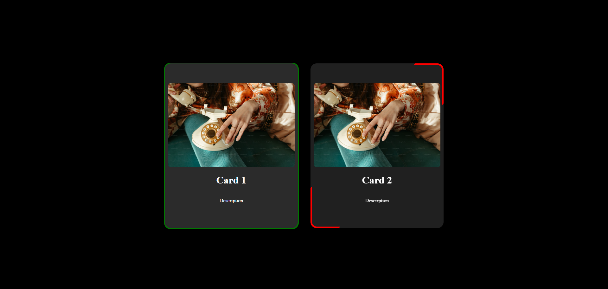

# Mini Projects

Welcome to my collection of mini-projects built using HTML, CSS, and JavaScript. Each project showcases different techniques and features that can be integrated into larger web applications. Feel free to explore and integrate these into your projects!

## Projects

### 1. Blur Loading

This project features a picture with a loading percentage that progresses from 0% to 100% with a cool blur effect. It's perfect for integrating into larger projects to provide a visually appealing loading experience.

- **Loading Animation:** Smooth transition from blurred to clear as the percentage increases.
- **Visual Feedback:** Gives users a sense of progress during loading.
- **Integration:** Easily adaptable for use in various web applications.
- **Use Case:** Can be used in image-heavy sites where loading times must be masked creatively.

  

### 2. Double Vertical Slide

In this project, you'll find images with their related names, displayed with vibrant background colors. The buttons allow you to slide the images both vertically and horizontally with smooth animations.

- **Image Carousel:** Displays images with associated text in a sliding format.
- **Multiple Slide Directions:** Users can slide images vertically and horizontally.
- **Animation Effects:** Smooth transitions enhance the user experience.
- **Customizable:** Background colors and animations can be easily modified to fit different themes.
- **Use Case:** Ideal for portfolios, galleries, or any content that benefits from visual navigation.

  

### 3. Random Choice Picker

This project lets users enter multiple choices, separated by commas, and randomly pick one with a cool animation. It's a fun and interactive way to make decisions.

- **User Input:** Users can input multiple choices, separated by commas.
- **Random Selection:** The app randomly selects one of the provided choices.
- **Animation:** Includes cool visual effects during the selection process.
- **Flexibility:** Can be used for games, decision-making, or any scenario where randomness adds excitement.
- **Use Case:** Great for creating interactive experiences, such as a "spin the wheel" game or a decision-making tool.

  
  
  

### 4. Live User Filter

Using the Randomuser [API](https://randomuser.me/), this project fetches random user information such as name, city, country, and images. It includes a search feature to filter users by name, city, or country, with the ability to search in both uppercase and lowercase.

- **API Integration:** Fetches random user data from the Random user API.
- **Search Functionality:** Users can search and filter results by name, city, or country.
- **Dynamic Filtering:** Supports case-insensitive search, making it easy to find specific users.
- **Responsive Design:** Adapts to different screen sizes, ensuring a seamless experience on any device.
- **Use Case:** Useful for building directories, contact lists, or any application requiring user data presentation and filtering.

  
  

### 5. Content Placeholder

It is a simple yet effective project that features a card with user details. When the page is refreshed, the card loads with a smooth animation before displaying the user details.

- **Loading Animation:** The card smoothly animates into view, creating a polished user experience.
- **Content Display:** Displays basic user details in a visually appealing card format.
- **Simplicity:** Easy to implement and integrate into larger projects.
- **Customizable:** The card's content and animation can be adjusted to fit different use cases.
- **Use Case:** Ideal for loading screens, placeholders for dynamic content, or skeleton UI patterns.

  
  

### 6. Gallery

This project is a responsive image gallery that adapts seamlessly to different screen sizes. The gallery displays images in an organized format, ensuring they look great on any device.

- **Responsive Design:** The gallery layout adjusts dynamically to various screen sizes, providing an optimal viewing experience on desktop and mobile devices.
- **Image Handling:** Images are displayed in a responsive format, scaling appropriately to maintain quality and clarity.
- **User-Friendly Interface:** The gallery is designed to be easy to navigate, with a clean and intuitive layout.
- **Customization:** The gallery’s layout, styling, and image handling can be customized to suit different projects or preferences.
- **Use Case:** Perfect for portfolios, product showcases, or any website that needs a visually appealing way to display images.
 
  
  
  

### 7. Animation Card

This project features interactive cards with animated border effects, creating a visually appealing and engaging user experience.

- **Animated Borders:** Each card includes unique border animations that trigger on hover, adding a dynamic and modern feel.
- **Interactive Design:** The hover effects enhance user interaction, making the cards visually appealing and engaging.
- **Customization:** Border animations and styles can be easily modified to fit different design themes or branding requirements.
- **Responsive Layout:** Cards are designed to be fully responsive, ensuring they look great on all devices and screen sizes.
- **Use Case:** Ideal for portfolios, feature highlights, service offerings, or any website section that benefits from eye-catching design elements.
   
  
  
  

## Getting Started

To explore these projects locally:

1. Clone the repository to your local machine:

   ```bash
   git clone https://github.com/MullaiVenese03/Mini-Projects.git
   ```
2. Navigate to the project folder you're interested in.
3. Open the `index.html` file in your web browser to view the project.

## Technologies Used in all Projects

- HTML
- CSS
- JavaScript
- [Ransom user API](https://randomuser.me/)

## Contributors

- [MullaiVenese](https://github.com/MullaiVenese03/)

## License

This project is licensed under the [🤍MullaiVenese](https://github.com/MullaiVenese03/).
